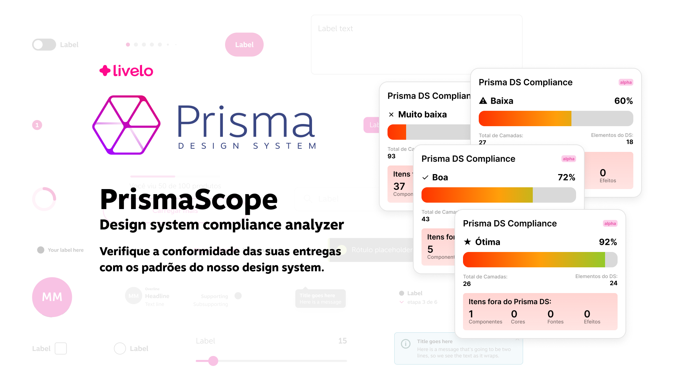
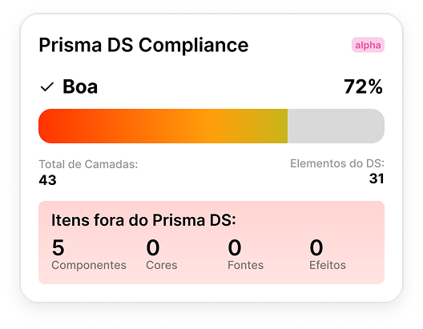

# 🧩 PrismaScope

Desenvolvemos um plugin para Figma que analisa a **cobertura do Prisma Design System** nas entregas de design.
Ele calcula a cobertura e adiciona um **cartão** ao lado de cada frame com as métricas encontradas.

## ❓ Por que criamos este plugin?

Um design system só gera valor quando é efetivamente utilizado. Como todo projeto começa na etapa de Design e segue para o time de Desenvolvimento, se o designer não estiver aplicando corretamente o **Prisma**, o desenvolvedor também terá dificuldades para utilizá-lo — ou precisará devolver o projeto para que o designer faça os ajustes necessários.

Esses problemas acontecem porque, na etapa de *handoff*, não fica claro se o design system está sendo utilizado e onde não está sendo aplicado.

Para resolver essas questões, este plugin permite que os designers verifiquem a **cobertura do design system** antes do *handoff*, apresentando os resultados de forma visual.

### Benefícios:
- **Designers** – recebem uma validação instantânea sobre a coesão e a aderência dos seus designs ao **Prisma**.
- **Desenvolvedores** – conseguem identificar rapidamente o que está em conformidade com o Prisma e o que precisa de ajustes, otimizando o planejamento e a entrega das funcionalidades.

## ⚙️ O que o plugin faz?

A partir de cada frame selecionado, o plugin:
1. Escaneia recursivamente todas as camadas internas dos frames selecionados.
2. Calcula as métricas de uso do design system.
3. Renderiza um **cartão de cobertura** ao lado de cada frame, indicando:
   - ✅ Porcentagem de cobertura
   - 🧱 Total de camadas
   - 🧩 Elementos do DS
   - 🚫 Elementos fora do DS:
     - Componentes
     - Fontes
     - Cores
     - Efeitos

## 📊 O cartão de cobertura

### Cálculo:
- **Total de camadas**: Número total de camadas, excluindo *Sections*, *Groups*, *Vectors* e *Frames estruturais*.
- **Componentes**: Número total de instâncias de componentes do Prisma utilizados a partir da biblioteca oficial.
- **Porcentagem de cobertura**:
  Calculada da seguinte forma:
  **Fórmula:** 
  `(Total de Elementos do DS / (Total de Camadas + Estilos fora do DS)) × 100`

### Interpretação da cobertura:
- **< 50%** → _Muito baixa_ – é necessário revisar e melhorar o uso do design system.
- **50% a 70%** → _Baixa_ – recomenda-se melhorar para atingir pelo menos 70%.
- **70% a 90%** → _Boa_ – o design está aceitável, mas ainda há espaço para melhorias.
- **> 90%** → _Ótima_ – o design está no nível esperado, pode seguir sem problemas.

### Itens fora do DS
- **Componentes**: Número de componentes que **não** são do Prisma – ou seja de outras bibliotecas.
- **Fontes**: Número de estilos tipográficos que **não** são do Prisma.
- **Cores**: Número de estilos de cor que **não** são do Prisma.
- **Efeitos**: Número de efeitos que **não** são do Prisma.

## ▶️ Como usar

1. **Abra seu arquivo no Figma** 
   Acesse o arquivo de design que deseja analisar.

2. **Selecione os frames que deseja verificar** 
   Você pode selecionar um ou mais frames de nível superior na página.

3. **Execute o plugin PrismaScope** 
   Vá até o menu do Figma:
   `Menu > Plugins > PrismaScope`

4. **Visualize os cartões de cobertura** 
   O plugin irá escanear os frames selecionados, calcular a cobertura do Prisma Design System e exibir um **cartão de cobertura** ao lado de cada frame.

5. **Revise os destaques visuais** 
   Elementos que **não utilizam o Prisma** serão destacados com bordas, facilitando a identificação de inconsistências.
