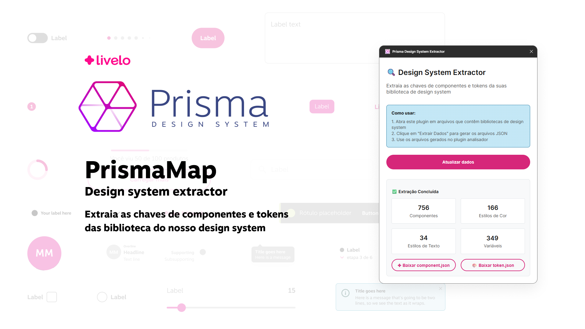

# 🗺️ PrismaMap

Este plugin para Figma permite extrair as chaves dos componentes e tokens de design (cores, textos, efeitos) das bibliotecas do seu Design System, gerando arquivos JSON prontos para análise posterior.



## ⚙️ Funcionalidades

- **Extração de componentes:** Exporta todos os componentes e component sets do arquivo Figma, incluindo o nome da página para garantir unicidade.
- **Extração de tokens de design:** Exporta estilos locais de cor, texto e efeito.
- **Geração de arquivos JSON:** Cria arquivos `.components.json` e `.styles.json` para uso em outros plugins ou ferramentas de análise.
- **Compatível com múltiplas páginas:** Suporta arquivos Figma com múltiplas páginas e componentes com nomes repetidos.

## ▶️ Como usar

1. **Abra o arquivo Figma** que contém sua biblioteca de Design System.
2. **Execute o plugin:**  
   - Menu Figma → Plugins → Design System Extractor
3. **Clique em "Extrair dados"** na interface do plugin.
4. **Baixe os arquivos gerados** (`.components.json` e `.styles.json`).
5. **Utilize os arquivos** no plugin de análise (`analyzer-plugin`) ou em outras ferramentas.

## 📄 Estrutura dos arquivos gerados

- **`<nome-do-arquivo>.components.json`**
  ```json
  {
    "metadata": { ... },
    "components": {
      "Página/Componente": {
        "key": "abc123...",
        "isHidden": false
      },
      ...
    }
  }
  ```
- **`<nome-do-arquivo>.styles.json`**
  ```json
  {
    "metadata": { ... },
    "colorStyles": { ... },
    "textStyles": { ... },
    "effectStyles": { ... }
  }
  ```


### Observações técnicas

- O nome do componente exportado inclui o nome da página para evitar colisões.
- O plugin utiliza as APIs assíncronas do Figma para garantir compatibilidade com múltiplas páginas e estilos.